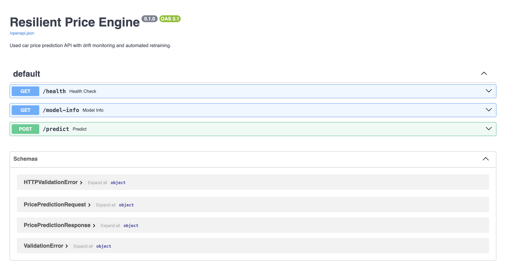
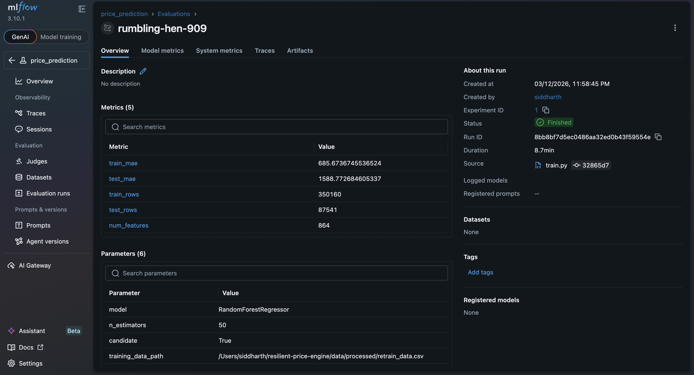
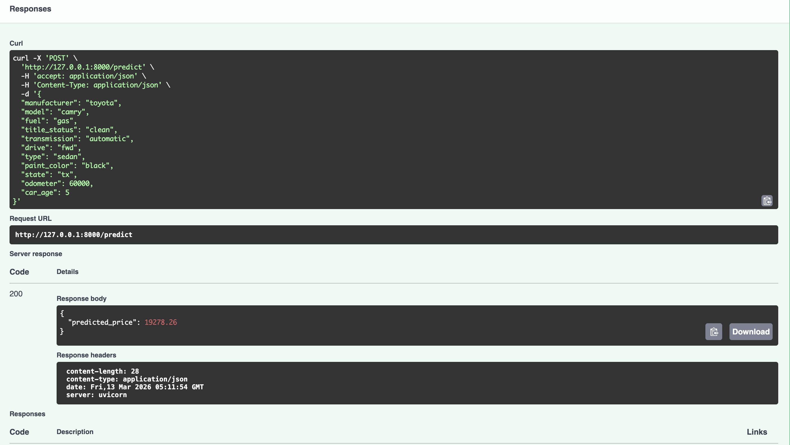

# Resilient Price Engine


An end-to-end machine learning system that predicts used car prices and automatically retrains when **data drift** is detected.

This project demonstrates a **production-style ML pipeline** including:

- model training
- experiment tracking
- inference API
- drift monitoring
- automated retraining

---

# System Architecture

```
                Training Pipeline
                        │
                        ▼
             RandomForestRegressor Model
                        │
                        ▼
                Saved Artifacts (joblib)
                        │
                        ▼
                 FastAPI Inference API
                        │
 Incoming Data ───► Drift Detection Service
                        │
               Drift Detected ?
                        │
                       Yes
                        ▼
                 Retraining Pipeline
                        │
                        ▼
                 MLflow Experiment
                        │
                        ▼
               Updated Production Model
```

---

# Screenshots

### FastAPI Documentation



### MLflow Experiment Tracking



### Price Prediction Endpoint



---

# Dataset

Dataset used:

**Craigslist Used Vehicles Dataset**

Source:
https://www.kaggle.com/datasets/austinreese/craigslist-carstrucks-data

The dataset contains **426k+ vehicle listings** across the United States.

Key fields include:

- manufacturer
- model
- fuel type
- odometer
- vehicle condition
- location
- listing metadata

After preprocessing the dataset was reduced to **~360k clean rows** used for training.

---

# Project Structure

```
resilient-price-engine/
│
├── api/
│   ├── main.py            # FastAPI application
│   └── schemas.py         # Request / response schemas
│
├── src/
│   ├── train.py           # Model training pipeline
│   ├── predict.py         # Prediction logic
│   ├── drift_detection.py # Drift monitoring
│   ├── config.py          # Project configuration
│   └── utils.py           # Helper functions
│
├── data/
│   ├── processed/         # Cleaned dataset
│   ├── raw/               # Original dataset
│   └── new_data.csv       # Simulated incoming data
│
├── artifacts/
│   ├── price_model.joblib
│   ├── model_features.joblib
│   ├── metrics.json
│   └── reference_data.csv
│
├── notebooks/
│   └── eda.ipynb
│
└── mlruns/                # MLflow experiment logs
```

---

# Model

The baseline model is a **RandomForestRegressor** trained on the processed vehicle dataset.

### Target Variable

```
price
```

### Features

| Feature      | Description       |
| ------------ | ----------------- |
| manufacturer | Vehicle make      |
| model        | Vehicle model     |
| fuel         | Fuel type         |
| title_status | Title condition   |
| transmission | Transmission type |
| drive        | Drive system      |
| type         | Vehicle body type |
| paint_color  | Exterior color    |
| state        | US state          |
| odometer     | Vehicle mileage   |
| car_age      | Age of vehicle    |

### Evaluation Metric

Mean Absolute Error (MAE)

| Split | MAE   |
| ----- | ----- |
| Train | ~745  |
| Test  | ~1818 |

---

# Quick Start

### Clone repository

```bash
git clone https://github.com/Siddharth-16/resilient-price-engine.git
cd resilient-price-engine
```

### Create environment

```bash
python -m venv venv
source venv/bin/activate
```

### Install dependencies

```bash
pip install -r requirements.txt
```

---

# Training Pipeline

Train the model with:

```bash
python -m src.train
```

The training pipeline performs:

1. dataset loading
2. preprocessing
3. one-hot encoding
4. train/test split
5. model training
6. evaluation
7. artifact saving
8. MLflow experiment logging

Artifacts saved:

```
artifacts/
price_model.joblib
model_features.joblib
metrics.json
```

---

# MLflow Experiment Tracking

Start the MLflow UI:

```bash
mlflow ui --backend-store-uri sqlite:///mlflow.db
```

Open:

```
http://127.0.0.1:5000
```

Tracked information:

- hyperparameters
- training metrics
- evaluation metrics
- model artifacts
- training dataset path

---

# Data Drift Detection

The system monitors incoming data for **distribution shift** using the **Kolmogorov–Smirnov statistical test**.

Run drift detection:

```bash
python -m src.drift_detection
```

Example output:

```
Drift detected — retraining model
```

### Automated Retraining Workflow

```
Incoming data
      ↓
Drift detection
      ↓
If drift detected
      ↓
Retrain model
      ↓
Evaluate candidate model
      ↓
Log experiment to MLflow
      ↓
Update production artifacts
```

---

# Running the API

Start FastAPI server:

```bash
uvicorn api.main:app --reload
```

API documentation:

```
http://127.0.0.1:8000/docs
```

---

# API Endpoints

### Health Check

```
GET /health
```

Response

```json
{ "status": "ok" }
```

---

### Price Prediction

```
POST /predict
```

Example request

```json
{
  "manufacturer": "ford",
  "model": "f-150",
  "fuel": "gas",
  "title_status": "clean",
  "transmission": "automatic",
  "drive": "4wd",
  "type": "truck",
  "paint_color": "white",
  "state": "ca",
  "odometer": 90000,
  "car_age": 8
}
```

Response

```json
{
  "predicted_price": 34058.42
}
```

---

### Model Metadata

```
GET /model-info
```

Example response

```json
{
  "model": "RandomForestRegressor",
  "train_mae": 745.05,
  "test_mae": 1818.69,
  "num_features": 327,
  "training_data_path": "data/processed/clean_vehicle_data.csv",
  "candidate": false
}
```

---

# Tech Stack

| Tool         | Purpose             |
| ------------ | ------------------- |
| Python       | Core language       |
| FastAPI      | API serving         |
| Scikit-Learn | Model training      |
| Pandas       | Data processing     |
| MLflow       | Experiment tracking |
| Joblib       | Model serialization |
| Uvicorn      | ASGI server         |

---

# Future Improvements

- Docker deployment
- CI/CD pipeline
- Feature store integration
- Real-time data ingestion
- Model registry promotion workflow

---

# License

MIT License
