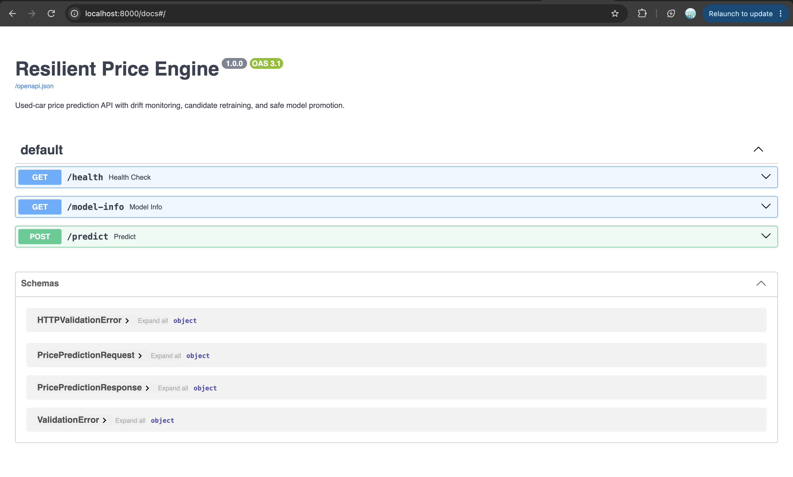
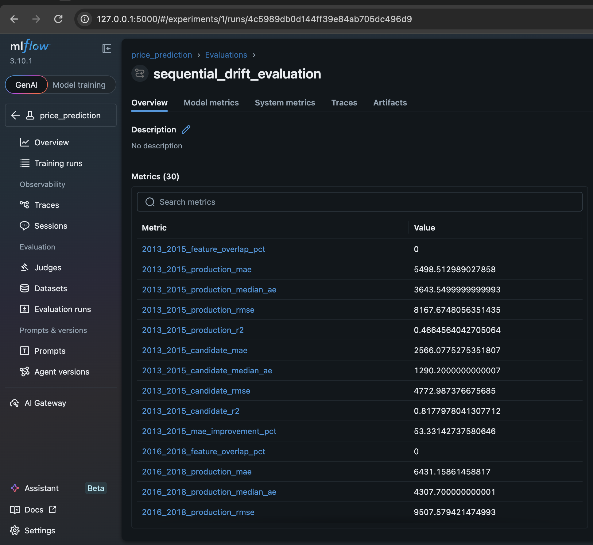
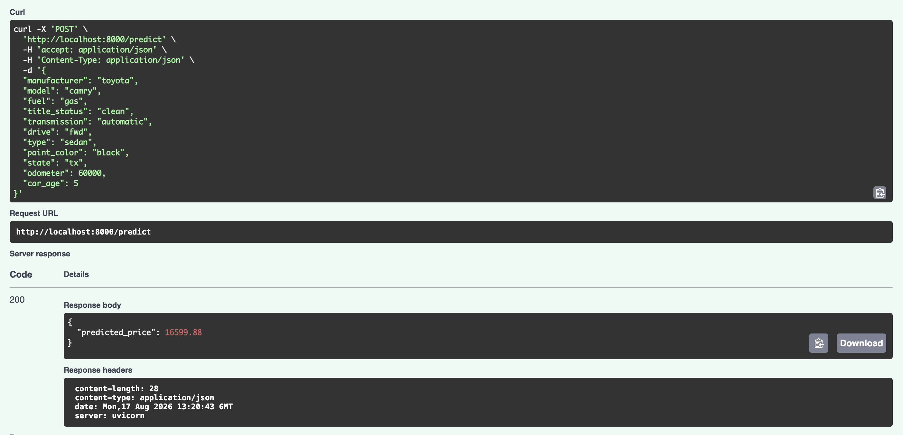

# Resilient Price Engine

**Production-style ML system for used-car price prediction, distribution-shift detection, automated retraining, and safe model promotion.**


Resilient Price Engine is an end-to-end machine learning system that predicts used-car prices and simulates how a production model can respond to distribution shift.

The project includes:

- reproducible data preprocessing
- model benchmarking across Random Forest, Extra Trees, and XGBoost
- leakage-resistant group-aware evaluation
- numeric and categorical drift detection
- automated candidate retraining
- holdout-gated model promotion
- MLflow experiment tracking
- FastAPI model serving
- automatic model reload after promotion
- regression tests
- Dockerized inference

---

## Key Results

Starting from **426,880 Craigslist vehicle listings**, the preprocessing pipeline retained **354,920 usable rows** after filtering invalid years, prices, mileage values, and duplicate listing IDs.

The final drift simulation used progressively newer vehicle cohorts:

| Cohort    | Incumbent MAE | Retrained MAE | MAE Improvement | Candidate R² |
| --------- | ------------: | ------------: | --------------: | -----------: |
| 2013–2015 |     $5,498.51 |     $2,566.08 |      **53.33%** |       0.8178 |
| 2016–2018 |     $6,431.16 |     $2,875.48 |      **55.29%** |       0.7700 |
| 2019–2022 |     $7,417.45 |     $3,321.75 |      **55.22%** |       0.7392 |

Candidate models were promoted in all three cohorts.

Evaluation uses a **group-aware split**, ensuring identical model-feature vectors never appear in both adaptation and evaluation data:

```text
Feature overlap rate: 0.00%
```

> **Note:** vehicle `year` represents model year, not listing time. Therefore, the sequential cohorts are used to **simulate distribution shift using progressively newer vehicle populations** rather than claiming true temporal production traffic.

---

## System Architecture

```text
                    Raw Craigslist Data
                            │
                            ▼
                  Preprocessing Pipeline
                            │
                            ▼
                 Baseline Vehicle Cohort
                       (2000–2012)
                            │
                            ▼
              Model Family Benchmarking
          Random Forest / Extra Trees / XGBoost
                            │
                            ▼
                 Production ML Pipeline
             OneHotEncoder + Extra Trees
                            │
               ┌────────────┴────────────┐
               │                         │
               ▼                         ▼
        FastAPI Inference          MLflow Tracking
               │
               │
               ▼
      Incoming Vehicle Cohort
               │
               ▼
          Drift Detection
      ┌────────┴─────────┐
      │                  │
 Numeric Drift      Categorical Drift
    KS Test         Jensen-Shannon
      │                  │
      └────────┬─────────┘
               │
        ≥ 2 drifted features?
               │
              Yes
               ▼
       Group-Aware 70/30 Split
               │
        ┌──────┴──────┐
        │             │
   Adaptation      Holdout
      70%            30%
        │             │
        ▼             │
 Candidate Retraining │
        │             │
        └──────┬──────┘
               ▼
      Candidate vs Incumbent
          on same holdout
               │
       MAE improvement ≥ 1%?
               │
              Yes
               ▼
        Promote Candidate
               │
               ▼
       Replace Production Model
               │
               ▼
    FastAPI reloads new artifact
```

---

## Dataset

The project uses the **Craigslist Used Vehicles Dataset**.

Source:

https://www.kaggle.com/datasets/austinreese/craigslist-carstrucks-data

### Preprocessing

The raw dataset contains:

```text
426,880 rows
```

The reproducible preprocessing pipeline:

- removes duplicate listing IDs
- retains model years from 2000–2022
- retains prices between $500 and $100,000
- retains odometer values between 0 and 300,000 miles
- normalizes categorical values
- fills missing categorical values with `unknown`
- derives vehicle age
- removes unused fields

Final usable dataset:

```text
354,920 rows
83.14% retention
```

### Simulated Cohorts

```text
baseline_2000_2012       144,931
incoming_2013_2015        80,175
incoming_2016_2018        88,615
incoming_2019_2022        41,199
```

---

## Model Features

The target variable is:

```text
price
```

Features:

| Feature        | Description                         |
| -------------- | ----------------------------------- |
| `manufacturer` | Vehicle manufacturer                |
| `model`        | Vehicle model                       |
| `fuel`         | Fuel type                           |
| `title_status` | Vehicle title status                |
| `transmission` | Transmission type                   |
| `drive`        | Drive configuration                 |
| `type`         | Vehicle body type                   |
| `paint_color`  | Exterior color                      |
| `state`        | US state                            |
| `odometer`     | Vehicle mileage                     |
| `car_age`      | Vehicle age derived from model year |

Categorical features are handled by `OneHotEncoder(handle_unknown="ignore")` inside the saved Scikit-learn pipeline.

---

## Model Selection

Three regression models are benchmarked using the same preprocessing pipeline:

- `RandomForestRegressor`
- `ExtraTreesRegressor`
- `XGBRegressor`

The model family with the lowest evaluation MAE is selected as the production model.

The current production model is:

```text
ExtraTreesRegressor
```

with:

```python
{
    "n_estimators": 50,
    "max_depth": None,
    "min_samples_leaf": 1,
    "max_features": 1.0
}
```

A 100-tree Extra Trees configuration was also tested, but the improvement over 50 trees was only about **0.29%**, so the smaller model was retained to reduce the cost of repeated retraining.

---

## Leakage-Resistant Evaluation

A standard random row split initially allowed identical feature combinations to appear in both training and evaluation data.

To prevent this, the project uses `GroupShuffleSplit`, grouping rows by the full model feature vector:

```text
manufacturer
model
fuel
title_status
transmission
drive
type
paint_color
state
odometer
car_age
```

This guarantees that identical feature vectors remain entirely in either training or evaluation.

All final incoming-cohort evaluations achieved:

```text
Feature overlap rate: 0.00%
```

---

## Drift Detection

The system monitors both numeric and categorical feature distributions.

### Numeric Drift

`odometer` is monitored using the **two-sample Kolmogorov–Smirnov test**.

Drift requires:

```text
KS statistic >= 0.10
p-value < 0.05
```

### Categorical Drift

The following features are monitored using **Jensen-Shannon distance**:

```text
manufacturer
fuel
transmission
drive
type
```

Drift threshold:

```text
JS distance >= 0.10
```

Retraining is triggered when at least:

```text
2 features
```

are classified as drifted.

### Why `car_age` is not monitored

`car_age` is still used by the prediction model.

However, it is intentionally excluded from drift triggering because it is derived directly from vehicle model year, while the simulated cohorts themselves are defined using model year.

Monitoring it would therefore create a drift signal by construction.

---

## Retraining and Model Promotion

For every incoming cohort:

```text
Incoming cohort
      │
      ▼
Group-aware split
  70% / 30%
      │
      ├── 70% → adaptation data
      │
      └── 30% → untouched evaluation holdout
```

If meaningful drift is detected, a candidate model is trained from scratch using:

```text
historical labeled data
+
70% current cohort adaptation data
```

The incumbent and candidate are then evaluated on the **same untouched 30% holdout**.

A candidate is promoted only when:

```text
Candidate MAE < Incumbent MAE
AND
MAE improvement >= 1%
```

After evaluation is complete, the full cohort becomes historical labeled data for the next simulated stage.

---

## MLflow Experiment Tracking

MLflow tracks:

- model family
- hyperparameters
- training metrics
- evaluation metrics
- drift metrics
- candidate performance
- model-selection results
- promotion outcomes
- dataset/cohort information

Start the MLflow UI:

```bash
mlflow ui --backend-store-uri sqlite:///mlflow.db
```

Then open:

```text
http://127.0.0.1:5000
```

---

## FastAPI Inference Service

The trained Scikit-learn pipeline is served using FastAPI.

Start the API:

```bash
uvicorn api.main:app --reload
```

Interactive documentation:

```text
http://127.0.0.1:8000/docs
```

### Model Hot Reload

The API tracks the modification time of:

```text
artifacts/price_model.joblib
```

When drift detection promotes a new candidate model and replaces the production artifact, the API automatically loads the new model on the next prediction request.

An API restart is not required.

---

## API Endpoints

### Health Check

```http
GET /health
```

Example:

```json
{
  "status": "ok",
  "model_ready": true
}
```

If no production model is available, the endpoint returns HTTP `503`.

---

### Price Prediction

```http
POST /predict
```

Example request:

```json
{
  "manufacturer": "ford",
  "model": "f-150",
  "fuel": "gas",
  "title_status": "clean",
  "transmission": "automatic",
  "drive": "4wd",
  "type": "truck",
  "paint_color": "white",
  "state": "ny",
  "odometer": 90000,
  "car_age": 8
}
```

Example response:

```json
{
  "predicted_price": 24051.32
}
```

---

### Model Metadata

```http
GET /model-info
```

Returns information including:

- production model family
- hyperparameters
- baseline metrics
- training/evaluation row counts
- split strategy
- feature overlap
- latest promoted cohort
- latest cohort metrics

---

## Tests

Run the test suite with:

```bash
pytest -v
```

Tests cover key ML and application behavior including:

- pipeline predictions
- unseen categorical values
- regression metrics
- group-aware splitting
- zero feature overlap
- numeric drift detection
- categorical drift detection
- candidate promotion logic
- request validation
- inference behavior

---

## Docker

Build the FastAPI inference image:

```bash
docker build -t resilient-price-engine .
```

Run:

```bash
docker run -p 8000:8000 resilient-price-engine
```

Then open:

```text
http://127.0.0.1:8000/docs
```

The Docker image packages the trained production pipeline with the FastAPI inference service.

---

## Project Structure

```text
resilient-price-engine/
│
├── api/
│   ├── main.py
│   └── schemas.py
│
├── src/
│   ├── preprocess.py
│   ├── train.py
│   ├── predict.py
│   ├── drift_detection.py
│   ├── config.py
│   └── utils.py
│
├── tests/
│   └── test_core.py
│
├── data/
│   ├── raw/
│   └── processed/
│
├── artifacts/
│   ├── price_model.joblib
│   ├── metrics.json
│   ├── model_benchmark.json
│   ├── drift_report.json
│   ├── reference_data.csv
│   └── training_data.csv
│
├── notebooks/
│   └── eda.ipynb
│
├── sql_analysis/
|   ├── import_csv.py
|   ├── queries.sql
|   └── README.md
|
├── Dockerfile
├── requirements.txt
├── pyproject.toml
└── README.md
```

---

## Quick Start

### 1. Clone the repository

```bash
git clone https://github.com/Siddharth-16/resilient-price-engine.git
cd resilient-price-engine
```

### 2. Create a virtual environment

```bash
python -m venv venv
source venv/bin/activate
```

### 3. Install dependencies

```bash
pip install -r requirements.txt
```

### 4. Preprocess the dataset

Place the Craigslist dataset in the expected raw-data location, then run:

```bash
python -m src.preprocess
```

### 5. Train and benchmark models

```bash
python -m src.train
```

### 6. Run the sequential drift simulation

```bash
python -m src.drift_detection
```

### 7. Start the inference API

```bash
uvicorn api.main:app --reload
```

---

## Screenshots

### FastAPI Documentation



### MLflow Experiment Tracking



### Price Prediction Endpoint



---

## Tech Stack

| Technology   | Purpose                            |
| ------------ | ---------------------------------- |
| Python       | Core application                   |
| Pandas       | Data preprocessing                 |
| Scikit-learn | ML pipelines and tree models       |
| XGBoost      | Model benchmarking                 |
| SciPy        | Statistical drift detection        |
| FastAPI      | Model inference API                |
| Pydantic     | API input validation               |
| MLflow       | Experiment tracking                |
| Joblib       | Model serialization                |
| Pytest       | Automated tests                    |
| Docker       | Reproducible inference environment |
| Uvicorn      | ASGI server                        |

---

## Limitations

- Distribution shift is simulated using progressively newer **vehicle model-year cohorts**, not true chronological production traffic.
- The project uses batch-based drift evaluation rather than a live streaming source.
- Retraining is performed locally rather than through a managed cloud model registry.
- Vehicle price estimates depend on the feature quality and coverage of the Craigslist dataset.

---

## Future Improvements

Potential extensions include:

- streaming ingestion with Kafka
- cloud-hosted model serving
- model registry integration
- inference latency and throughput monitoring
- richer prediction observability

These are intentionally outside the current scope; the project focuses on the core ML lifecycle from training through drift-aware retraining and serving.

---

## License

MIT License
