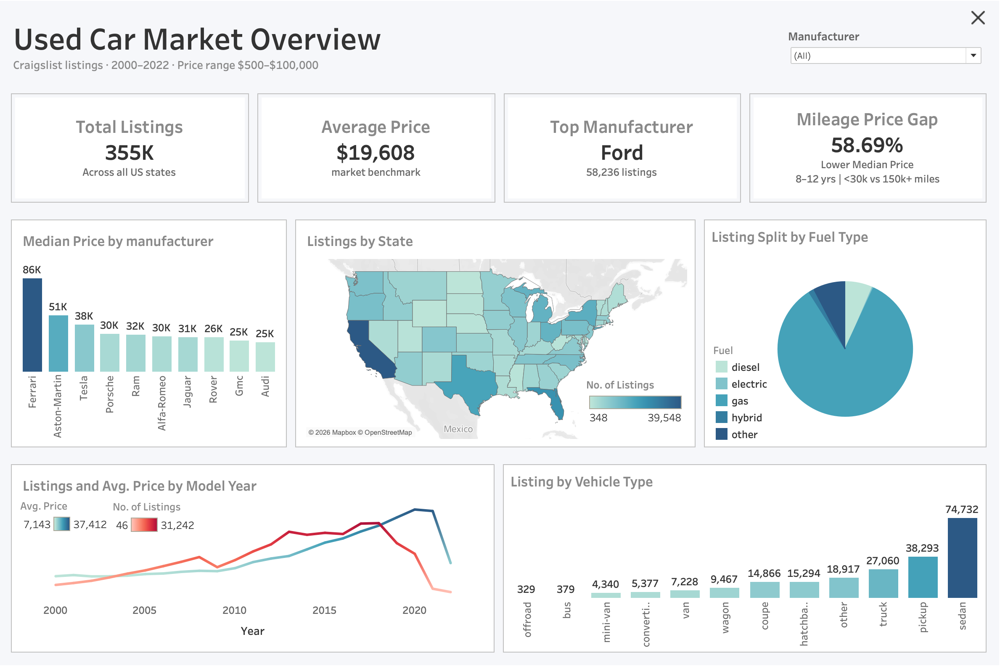

# Market Analysis & Model Diagnostics

SQL and Tableau analysis of the Craigslist used-vehicle dataset,
covering market structure, pricing relationships, vehicle-segment
composition, and held-out model performance.

The analysis uses the same cleaned vehicle population as the machine
learning pipeline, ensuring that exploratory analysis and predictive
modeling are based on consistent preprocessing rules.

## Dataset

The raw Craigslist dataset contains 426,880 listings.

After deduplication and filtering invalid model years, prices, and
odometer readings, the preprocessing pipeline retains 354,920 usable
listings from model years 2000–2022.

The analysis dataset preserves `id` and `year` for SQL and Tableau,
while the model-ready dataset excludes listing identifiers and uses
derived `car_age` instead of model year.

## Business Questions

1. How does mileage relate to vehicle price within comparable vehicle-age groups?
2. How does vehicle-type composition affect manufacturer-level price comparisons?
3. Which manufacturers and vehicle types are hardest for the price model to predict?
4. Does model error vary across vehicle age and mileage segments?
5. Why are older, low-mileage vehicles associated with larger dollar prediction errors?

## Key Findings

### Age-Controlled Mileage Pricing

After controlling broadly for vehicle age, higher mileage remained
associated with lower listing prices.

For vehicles aged 8–12 years, median listing price declined from
**$22,995 below 30k miles to $9,500 above 150k miles — a 58.7% difference**.

The relationship was not strictly monotonic across every age group.
For 4–7-year-old vehicles, the 150k+ mileage segment showed an
unexpected increase in price. Further analysis showed that this group
was disproportionately composed of higher-priced trucks and pickups,
demonstrating how vehicle composition can confound aggregate pricing
comparisons.

### Manufacturer and Vehicle-Type Composition

Vehicle type explained substantial variation within individual
manufacturers.

For example:

- Ford pickup median price: **$28,990**
- Ford sedan median price: **$7,995**
- Chevrolet pickup median price: **$28,999**
- Chevrolet sedan median price: **$7,995**
- Toyota pickup median price: **$27,990**
- Toyota sedan median price: **$9,200**

These results show why raw manufacturer-level average prices should
not be interpreted without considering each brand's vehicle mix.

### Model Error by Segment

Held-out predictions were analyzed using MAE, residual bias, and WAPE
to identify model-performance differences hidden by aggregate metrics.

Truck predictions produced approximately **$3,132 MAE**, compared with
approximately **$1,410 MAE for sedans**.

Several higher-value segments also showed positive residual bias,
indicating systematic underprediction. Trucks averaged approximately
**+$777 residual**, while pickups averaged approximately **+$567**.

### Low-Mileage Vehicle Diagnostics

Among older vehicles in the baseline evaluation cohort, lower-mileage
vehicles showed substantially larger dollar prediction errors.

Further analysis showed that this was not explained solely by
vehicle-type composition. The pattern persisted within major segments
such as sedans, SUVs, coupes, and trucks.

However, relative error did not consistently worsen at lower mileage.
Low-mileage vehicles also tended to have higher prices and greater price
dispersion, indicating that the larger dollar errors were driven by a
combination of:

- higher vehicle values
- greater price heterogeneity
- segment composition
- systematic underprediction in selected groups

This distinction prevents interpreting higher MAE alone as universally
worse proportional model performance.

## Dashboard

The Tableau dashboard provides an interactive market overview built on
the cleaned analysis dataset.

It includes:

- total listing volume
- market price benchmark
- top manufacturer
- age-controlled mileage price gap
- median price by manufacturer
- geographic listing distribution
- fuel-type composition
- listing and price patterns by model year
- vehicle-type distribution

Vehicle type can also be selected directly from the dashboard to filter
the other market views.

## Model Diagnostics

Model diagnostics are performed on the held-out evaluation dataset
rather than the full market dataset.

The SQL analysis evaluates:

- MAE and residual bias by manufacturer
- MAE and residual bias by vehicle type
- error by mileage segment
- error by vehicle-age segment
- low-mileage prediction behavior within comparable vehicle types

Because the held-out baseline evaluation cohort contains model years
2000–2012, its age-based diagnostic results primarily represent older
vehicles and should not be interpreted as performance across the full
2000–2022 population.

## Files

- `queries.sql` — Market analysis, segmentation, and model-diagnostic SQL queries
- `import_csv.py` — Loads the canonical cleaned analysis dataset into MySQL
- `export_predictions.py` — Generates row-level held-out predictions and prediction-error metrics
- `Dashboard.png` — Tableau market-overview dashboard

## Notes

- `year` refers to **vehicle model year**, not listing date.
- Pricing comparisons describe associations in Craigslist listing data
  and should not be interpreted as causal depreciation estimates.
- `price` represents advertised listing price rather than confirmed
  transaction price.
- Minimum sample thresholds are used in segmented analyses to reduce
  conclusions based on very small groups.
